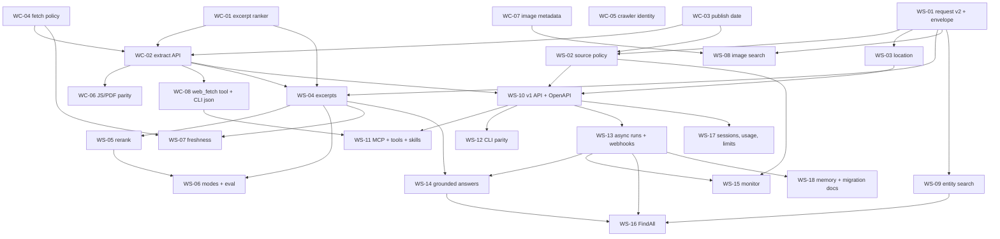

# Issue 29: parallel.ai feature parity — case study and cross-repository issue plan

Issue [#29](https://github.com/link-assistant/web-search/issues/29) asks for
everything parallel.ai offers to be supported (and improved on) by the
link-assistant stack, with search work tracked in this repository and pure web
fetching tracked in [web-capture](https://github.com/link-assistant/web-capture).
This document is the deep case study requested by the issue: collected data,
a verified inventory of parallel.ai, a gap analysis against the current
`web-search` and `web-capture` code, the list of every requirement from the
issue with candidate solutions and selected plans, and a dependency-ordered
set of ready-to-file issues for both repositories.

All work belongs to PR [#30](https://github.com/link-assistant/web-search/pull/30).
Issue #29 (no comments, labels `documentation` and `good first issue`) and
PR #30 (no comments) were read on 2026-10-07.

## Scope and checklist

- [x] Read issue #29, its comments, and PR #30; snapshot them to `data/`.
- [x] Snapshot the issue lists of both repositories and the web-capture README to `data/`.
- [x] Download the complete public parallel.ai documentation (111 pages, OpenAPI
      spec, `llms.txt`, agent skill file) with a reproducible script.
- [x] Verify every parallel.ai feature claim against the downloaded docs, not from memory.
- [x] Map the current capabilities of `web-search` (JS + Rust) and `web-capture`.
- [x] Build the gap analysis and decide, per feature, which repository owns it.
- [x] Search online for existing components and libraries for each gap.
- [x] Write solution alternatives, the selected plan, and verification for every requirement.
- [x] Draft one issue file per planned work item with explicit dependencies (`issues/`).
- [x] Provide an unexecuted script that files the drafts in the right repository.
- [ ] Final PR description, CI check, clean working tree, mark PR #30 ready.

Issues were **drafted, not filed**. Filing 26 issues across two repositories is
an outward-facing action that can trigger automated solvers; the drafts and the
`experiments/issue-29/file-issues.sh` script let a maintainer file them in one
command after review.

## Complete requirements and proposed solutions

| Source | Requirement                                                                                                         | Alternatives and selected plan                                                                                                                                                                                                                                                                                                          | Verification                                                                |
| ------ | ------------------------------------------------------------------------------------------------------------------- | --------------------------------------------------------------------------------------------------------------------------------------------------------------------------------------------------------------------------------------------------------------------------------------------------------------------------------------- | --------------------------------------------------------------------------- |
| #29 R1 | Provide services better than parallel.ai: "everything expected from them should be also supported by us".           | (a) Clone the API surface 1:1; (b) only add features the stack can do without hosted LLMs; (c) **selected:** full inventory of parallel.ai, wire-compatible Search/Extract first, then async/agent features with pluggable LLM so the open-source stack can exceed parallel.ai on openness, cost, self-hosting, and provider diversity. | Feature inventory (§ parallel.ai inventory) and gap table (§ Gap analysis). |
| #29 R2 | Search-related work is filed as issues in `web-search`.                                                             | Eighteen draft issues `WS-01…WS-18` under `issues/`, each with dependencies, scope, acceptance criteria.                                                                                                                                                                                                                                | `ls docs/case-studies/issue-29/issues/web-search-*.md`.                     |
| #29 R3 | Pure web-fetching work is filed as issues in `web-capture`.                                                         | Eight draft issues `WC-01…WC-08` under `issues/`; web-search issues that need them list them as dependencies.                                                                                                                                                                                                                           | `ls docs/case-studies/issue-29/issues/web-capture-*.md`.                    |
| #29 R4 | Deep analysis and a plan of all issues in both repositories with clear dependencies.                                | Gap analysis per feature → owning repository → issue id; dependency graph (mermaid) and phased order in § Cross-repository plan.                                                                                                                                                                                                        | Graph is acyclic; every issue lists `Depends on`.                           |
| #29 R5 | Collect the data to `./docs/case-studies/issue-29` and use it for the analysis; search online for additional facts. | Raw data in `data/` (issue/PR JSON, issue lists, web-capture README, 114 parallel.ai doc files); online research on competitors and components recorded in § Research and findings.                                                                                                                                                     | `data/` listing and the download script in `experiments/issue-29/`.         |
| #29 R6 | List each and all requirements, propose possible solutions and solution plans, check existing components/libraries. | This table plus § Per-feature solutions, which gives alternatives, selected plan, and candidate libraries for every gap.                                                                                                                                                                                                                | Every WS/WC draft references its component candidates.                      |

## Research and findings

### Data collected

| Path                                                | Content                                                                                                                                          |
| --------------------------------------------------- | ------------------------------------------------------------------------------------------------------------------------------------------------ |
| `data/issue-29.json`, `data/issue-29-comments.json` | Issue body and (empty) comment list.                                                                                                             |
| `data/web-search-issues.json`                       | All 30 issues/PRs of this repository (only #29/#30 open).                                                                                        |
| `data/web-capture-issues.json`                      | All issues of web-capture (only #160 open; #130 "structured search-provider capture API" and #135 "FormalAI contract" are the relevant history). |
| `data/web-capture-README.md`                        | web-capture README at the time of analysis.                                                                                                      |
| `data/parallel-docs/*.md`                           | 111 docs.parallel.ai pages (markdown rendition served with the `.md` suffix), named `section_page.md`.                                           |
| `data/parallel-docs/public-openapi.json`            | parallel.ai OpenAPI 3.1 spec: 37 operations, 183 schemas.                                                                                        |
| `data/parallel-docs/llms.txt`, `parallel-agents.md` | parallel.ai docs index and the `parallel-cli-setup` agent skill.                                                                                 |

Reproduce with `bash experiments/issue-29/download-parallel-docs.sh`
(run from the repository root; it only uses `curl`). The `data/` folder is
excluded from prettier by `js/.prettierignore`.

### parallel.ai inventory (verified from the downloaded docs, 2026-10-07)

Endpoints are from `public-openapi.json`; limits, pricing, and latency are from
`getting-started_pricing.md`, `getting-started_rate-limits.md`, and the
product pages named in each row.

| Product               | Endpoint(s)                                                                                                                                                                                                                                                                                                                                                                                                                                                                                                                                 | Inputs                                                                                                                                                                                                                                                                                                                        | Outputs                                                                                                                                                                   | Latency / price / quota                                                                 | Local doc                                                                                                                |
| --------------------- | ------------------------------------------------------------------------------------------------------------------------------------------------------------------------------------------------------------------------------------------------------------------------------------------------------------------------------------------------------------------------------------------------------------------------------------------------------------------------------------------------------------------------------------------- | ----------------------------------------------------------------------------------------------------------------------------------------------------------------------------------------------------------------------------------------------------------------------------------------------------------------------------- | ------------------------------------------------------------------------------------------------------------------------------------------------------------------------- | --------------------------------------------------------------------------------------- | ------------------------------------------------------------------------------------------------------------------------ |
| Search                | `POST /v1/search` (`/v1beta/search` legacy)                                                                                                                                                                                                                                                                                                                                                                                                                                                                                                 | `search_queries` (1–5, 3–6 words, ≤200 chars; extra dropped with warning), `objective` (≤5000), `mode` turbo/fast/basic/advanced (default advanced), `max_chars_total`, `client_model`, `session_id` (≤1000), `advanced_settings` {source_policy, fetch_policy, excerpt_settings, location, max_results (default 10, cap 20)} | `search_id`, `results[]{url,title,publish_date,excerpts[]}`, `warnings`, `usage[{name:"sku_search",count}]`, `session_id`                                                 | 200 ms–3 s; $1/1k (turbo, fast), $5/1k (basic, advanced), +$1/1k extra results; 600/min | `search_search-quickstart.md`, `search_modes.md`, `search_advanced-search-settings.md`, `api-reference_search_search.md` |
| Image Search          | `POST /v1/images/search`                                                                                                                                                                                                                                                                                                                                                                                                                                                                                                                    | keyword queries, optional objective, `mode` fast/advanced                                                                                                                                                                                                                                                                     | `title`, `image_url`, `source_page_url`, `width`, `height` (≤20 results)                                                                                                  | 1–3 s; $1/$5 per 1k; 600/min                                                            | `image-search_image-search-quickstart.md`, `image-search_modes.md`                                                       |
| Extract               | `POST /v1/extract`                                                                                                                                                                                                                                                                                                                                                                                                                                                                                                                          | `urls` (≤20), `objective`, `search_queries`, `max_chars_total`, `client_model`, `session_id`, `advanced_settings` {fetch_policy{max_age_seconds}, excerpt_settings{max_chars_per_result}, full_content bool/object}                                                                                                           | `extract_id`, `results[]{url,title,publish_date,excerpts[],full_content?}`, `errors[]{url,error_type}`, `warnings`, `usage`, `session_id`                                 | 1–20 s; $1/1k URLs; 600/min; JS pages and PDFs → markdown                               | `extract_extract-quickstart.md`, `extract_advanced-extract-settings.md`                                                  |
| Task                  | `POST /v1/tasks/runs`, `GET …/{run_id}`, `/result`, `/input`, `/events` (SSE); task groups `/v1/tasks/groups…`; `POST /v1beta/findall/ingest`                                                                                                                                                                                                                                                                                                                                                                                               | input text/JSON, `task_spec` (text, JSON schema, auto), `processor` lite…ultra8x, `source_policy`, `webhook`, `memory_scope_key`, MCP servers, data connectors, interactions (`previous_run_id`)                                                                                                                              | run id, status queued→running→completed/failed, output text/JSON + `basis[]{field,citations[{url,excerpts}],reasoning,confidence}`                                        | 10 s–2 h; $5–$2400 per 1k runs; 2000/min                                                | `task-api_task-quickstart.md`, `task-api_guides_choose-a-processor.md`, `task-api_guides_access-research-basis.md`       |
| Responses             | `POST /v1/responses` (OpenAI Responses wire format, Bearer auth, model `parallel`)                                                                                                                                                                                                                                                                                                                                                                                                                                                          | `input`, `reasoning.effort` low/medium/high, `previous_response_id`, `text.format` json_schema, `tools` (`web_search` with allowed/blocked domains, `mcp`), `stream`                                                                                                                                                          | output text with `url_citation` annotations, `web_search_call` items (`search`, `open_page`), SSE events                                                                  | 5–60 s; $10/$50/$250 per 1k                                                             | `responses-api_responses-quickstart.md`, `responses-api_features_*.md`                                                   |
| Chat (beta)           | `POST /v1beta/chat/completions`                                                                                                                                                                                                                                                                                                                                                                                                                                                                                                             | OpenAI chat messages, `stream`, research models (Task processors)                                                                                                                                                                                                                                                             | chat completion, SSE                                                                                                                                                      | 300/min                                                                                 | `api-reference_chat-api-beta_chat-completions.md`                                                                        |
| FindAll (public beta) | `POST /v1beta/findall/runs`, `/ingest`, `/{id}` status, `/result`, `/schema`, `/events`, `/enrich`, `/extend`, `/cancel`                                                                                                                                                                                                                                                                                                                                                                                                                    | natural-language objective → `entity_type` + `match_conditions`, `generator` preview/base/core/pro, `match_limit`, exclusions, webhook                                                                                                                                                                                        | candidates with `match_status` generated/matched/unmatched, basis + citations, enrichments via Task processors                                                            | 10 s–2 h; $0.10–$10 fixed + $0–$1 per match; 300/hour                                   | `findall-api_findall-quickstart.md`, `findall-api_core-concepts_*.md`                                                    |
| Entity Search         | `POST /v1beta/findall/entity-search`                                                                                                                                                                                                                                                                                                                                                                                                                                                                                                        | `entity_type` people/companies, `objective`, `match_limit` 5–1000 (default 100)                                                                                                                                                                                                                                               | `entity_set_id`, ranked `entities[]{name,url,description}`; no pagination                                                                                                 | 1–3 s; $5/1k (100 included); 600/min                                                    | `findall-api_entity-search.md`                                                                                           |
| Monitor (GA May 2026) | `POST /v1/monitors`, list, stats, retrieve, `/cancel`, `/events`, `/trigger`, `/update`                                                                                                                                                                                                                                                                                                                                                                                                                                                     | `type` event_stream or snapshot (`settings.task_run_id`), query, `frequency` `1h`/`1d`/`1w`, processor lite/base, `source_policy`, webhook, structured output                                                                                                                                                                 | events with `basis`, `changed_output`/`previous_output` for snapshots; webhook events `monitor.event.detected`, `monitor.execution.completed`, `monitor.execution.failed` | runs once at creation then on schedule; $3/$10 per 1k checks; 300/min                   | `monitor-api_monitor-quickstart.md`, `monitor-api_monitor-events.md`                                                     |
| Memory (rolling out)  | `POST /v1beta/memory/retrieve`, `/evict`, `/clear`                                                                                                                                                                                                                                                                                                                                                                                                                                                                                          | `memory_scope_key` set on Task/Monitor/FindAll runs                                                                                                                                                                                                                                                                           | memories of past runs; explicit retrieval only                                                                                                                            | —                                                                                       | `resources_memory.md`                                                                                                    |
| Webhooks              | `webhook` object on Task, FindAll, Monitor                                                                                                                                                                                                                                                                                                                                                                                                                                                                                                  | `url`, `event_types`                                                                                                                                                                                                                                                                                                          | Standard Webhooks headers `webhook-id`, `webhook-timestamp`, `webhook-signature` (`v1,<base64 HMAC-SHA256>` over `id.timestamp.body`, `whsec_` secret)                    | —                                                                                       | `resources_webhook-setup.md`                                                                                             |
| Source policy         | shared object on Task, Search, Monitor, Responses                                                                                                                                                                                                                                                                                                                                                                                                                                                                                           | `include_domains`, `exclude_domains` (only when include empty), `after_date` (Search only); apex includes subdomains, `www.` normalized, path prefixes at segment boundaries (case-sensitive), bare extensions like `.gov`, no wildcards/schemes/ports/queries, 200 entries max combined                                      | —                                                                                                                                                                         | —                                                                                       | `resources_source-policy.md`                                                                                             |
| Integrations          | `parallel-cli` (pipx/uv/brew/npm/binary; `search`, `extract`, `research`, `enrich`, `findall`, `monitor`, OAuth `login`), Search MCP (`web_search`, `web_fetch`, free anonymous `fast` tier, header/query overrides, `/mcp-oauth`), Task MCP, agent skills, Claude Code / Cursor marketplaces, OpenAI/Anthropic/Gemini tool definitions, LangChain, LiteLLM, OpenRouter, Vercel AI SDK, Browser Use, GSuite, OAuth provider, Account API, Machine Payments Protocol, DuckDB/Polars/BigQuery/Spark connectors, SDKs `parallel-web` (pip/npm) | —                                                                                                                                                                                                                                                                                                                             | —                                                                                                                                                                         | —                                                                                       | `integrations_*.md`, `data-integrations_*.md`                                                                            |
| Docs / crawler        | `llms.txt`, `llms-full.txt`, `.md` suffix pages, OpenAPI 3.1; crawler ShapBot UA `Mozilla/5.0 AppleWebKit/537.36 (KHTML, like Gecko); compatible; ShapBot/0.1.0`, published IP list, "Index for content owners"                                                                                                                                                                                                                                                                                                                             | —                                                                                                                                                                                                                                                                                                                             | —                                                                                                                                                                         | —                                                                                       | `llms.txt`, `resources_crawler.md`                                                                                       |

Other facts that shape the plan:

- Search `mode` differences (`search_modes.md`): turbo ≈200 ms, English and Japanese only, no path-prefix filters; fast ≈700 ms (recommended default for agents); basic ≈1 s with longer excerpts; advanced ≈3 s for multi-hop research. Default when omitted is `advanced`.
- Search uses the parallel.ai index by default and only fetches live pages when `fetch_policy` asks for freshness (`search_indexed-content-for-agents.md`). Live fetch "may take up to a minute".
- `location` accepts 37 ISO 3166-1 alpha-2 codes (`gb`, not `uk`); invalid codes are ignored with a warning.
- Errors are `{type:"error", error:{ref_id, message}}` with HTTP 401/402/422/429/5xx (`resources_warnings-and-errors.md`); 429 recommends exponential backoff.
- Migration guide (`search_migrate-to-parallel.md`) maps Exa `instant/fast/auto`, Tavily `ultra-fast/fast/basic/advanced`, Tavily `include_domains`/`start_date`/`country`, and SERP APIs to parallel.ai fields. This mapping is reused below so the same request shape also covers Tavily/Exa clients.
- Positioning claims (`search_best-practices.md`): token-efficient excerpts instead of SERP links, several queries in one request, publish-date metadata, and no fetch round needed. The Artificial Analysis Search Index and a "Search Capability Leaderboard" are cited in the changelog (Aug 19 and Sep 15, 2026).
- Limits of parallel.ai that the open stack can beat: public web only, no login pages (FAQ); no image inputs; US-only data centers; proprietary index; per-request billing; results capped at 20; no self-hosting except enterprise; `turbo` restricted to two languages.

### Current capabilities of the link-assistant stack

**web-search** (`js/` 0.11.1, `rust/` 0.6.0, parity enforced by `js/scripts/check-js-rust-parity.mjs`):

- 40 providers in four categories (search, knowledge, papers, code) driven by descriptors (`js/src/providers/registry.js`, `rust/src/registry.rs`), including `wc:*` providers that delegate to web-capture.
- Merge strategies RRF (`rrf_k` 60), weighted, interleave with URL dedupe (`js/src/merger.js`, `rust/src/merger.rs`); `searchDetailed` returns per-provider outcomes and receipts; caller-owned transport and `AbortSignal`.
- Options: `limit`, `language`, `region`, `safeSearch`, `providers`, `strategy`, `weights`. Result: `{title,url,snippet,source,rank,score?,sources?}`.
- HTTP: `GET|POST /search`, `/search/:provider`, `/providers?category`, `/categories`, `/health`. CLI: `--providers`, `--limit`, `--strategy`, `--format text|json|urls`, `--language`, `--region`, `--safe`, `--list-providers`, `serve --port`.
- No objective/excerpts, no source policy, no publish dates, no reranking, no async runs, no webhooks, no MCP, no SSE, no OpenAPI spec, no usage/warnings envelope, no image or entity search.

**web-capture** (from `data/web-capture-README.md` and its FormalAI contract):

- Routes `/fetch /html /txt /markdown /image /archive /pdf /docx /stream /search /shared-dialog`; CLI `web-capture <URL> --format markdown|html|txt|png`, archives, Google Docs, PDFs, DOCX, LaTeX, StackOverflow, GitHub, xpaste modules; Puppeteer/Playwright browser capture through browser-commander; turndown/html2md/kreuzberg converters.
- Transport/receipt contract (`captureResponse`, `fetchHtmlReceipt`, `search` in JS; `*_with_transport` in Rust) with `AbortSignal`; content-addressed `CaptureStore`/`CachedTransport` cache with TTL and offline replay (issue #156).
- `/search?q&provider&limit&format` for wikipedia/duckduckgo/google/bing/brave returns `{query, provider, captureMode, capturedAt, results[], diagnostics}`; the README states that no web-search-backed provider catalog is implemented there, which matches the issue's split (search catalog lives here).
- Missing for parallel.ai parity: batch extract endpoint, objective-focused excerpt ranking, `max_chars` controls, publish-date metadata, explicit `max_age_seconds` fetch policy on the public API, a documented crawler identity/IP list, image dimensions in a search-oriented shape.

### Gap analysis and ownership

| parallel.ai capability                                                                             | web-search today              | web-capture today            | Owner                                              | Issue                      |
| -------------------------------------------------------------------------------------------------- | ----------------------------- | ---------------------------- | -------------------------------------------------- | -------------------------- |
| `objective` + 1–5 `search_queries` per request, warnings, usage, `search_id`/`session_id` envelope | single `q`                    | —                            | web-search                                         | WS-01                      |
| Source policy (include/exclude domains and paths, `after_date`, normalization rules)               | —                             | —                            | web-search                                         | WS-02                      |
| `location` (ISO alpha-2) and language targeting per provider                                       | `region`/`language` free-form | —                            | web-search                                         | WS-03                      |
| Publish date per result                                                                            | —                             | metadata module, not exposed | web-capture → web-search                           | WC-03, WS-01               |
| Excerpts (`max_chars_per_result`, `max_chars_total`) from fetched pages                            | snippets only                 | markdown conversion exists   | web-capture (ranking) + web-search (orchestration) | WC-01, WC-02, WS-04        |
| Fetch policy (`max_age_seconds`, index vs live)                                                    | —                             | CaptureStore cache internal  | web-capture → web-search                           | WC-04, WS-07               |
| Reranking and relevance scores                                                                     | RRF ordinal only              | —                            | web-search                                         | WS-05                      |
| Modes turbo/fast/basic/advanced                                                                    | —                             | —                            | web-search                                         | WS-06                      |
| Extract API (≤20 URLs, objective excerpts, `full_content`, per-URL errors, JS + PDF)               | —                             | single-URL routes            | web-capture                                        | WC-02, WC-06               |
| Image search (`image_url`, `source_page_url`, `width`, `height`)                                   | —                             | `/image` route (screenshots) | web-search + web-capture                           | WS-08, WC-07               |
| Entity search (people/companies)                                                                   | —                             | —                            | web-search                                         | WS-09                      |
| Wire-compatible `/v1/search`, `/v1/extract`, error format, OpenAPI 3.1, rate limits                | custom shape                  | custom shape                 | web-search (+ WC-02 for extract)                   | WS-10, WS-17               |
| MCP server (`web_search`, `web_fetch`), tool definitions, agent skills                             | —                             | —                            | web-search (tools) + web-capture (fetch)           | WS-11, WC-08               |
| CLI parity (`search`, `extract`, `--json`, `--include-domains`, `--after-date`, `--mode`)          | partial                       | `web-capture` CLI            | web-search                                         | WS-12                      |
| Async task runs, task groups, SSE, Standard Webhooks                                               | —                             | —                            | web-search                                         | WS-13                      |
| Grounded answers (Responses/Chat compatibility, citations, structured outputs, streaming)          | —                             | —                            | web-search                                         | WS-14                      |
| Monitor (event stream, snapshot, schedule, webhooks)                                               | —                             | —                            | web-search                                         | WS-15                      |
| FindAll (entity discovery with match conditions, enrichment)                                       | —                             | —                            | web-search                                         | WS-16                      |
| Memory (`memory_scope_key`, retrieve/evict/clear)                                                  | —                             | —                            | web-search                                         | WS-18                      |
| Eval harness and migration guides (Tavily/Exa/SERP/parallel.ai)                                    | —                             | —                            | web-search                                         | WS-18 (eval part in WS-06) |
| Crawler identity, robots, published IP list, politeness                                            | —                             | user agent not documented    | web-capture                                        | WC-05                      |
| Authenticated page access (parallel.ai Task API, Jan 2026)                                         | —                             | —                            | web-capture                                        | WC-08 (optional part)      |

### Per-feature solutions, alternatives, and candidate components

Each subsection lists the alternatives considered, the selected plan, and
components found online that can be reused. Library choices favour permissive
licences and both JavaScript and Rust availability because of the parity rule.

**WS-01 Search request v2 and response envelope.** Alternatives: (a) keep `q`
and add optional fields; (b) new `/v1/search` body with `search_queries[]`,
`objective`, `max_results`, warnings and usage. Selected: (b) while keeping the
legacy `GET /search?q=` route; fan out one provider call per query, merge with
the existing RRF across (provider × query) lists, emit `warnings[]` for dropped
queries (>5), clamped `max_results` (>20) and unsupported settings exactly as
parallel.ai does so clients can be switched by changing the base URL. Components:
existing `mergeResults`; `zod` (JS) and `serde`/`validator` (Rust) for 422
validation; `ajv` for JSON schema in tests.

**WS-02 Source policy.** Alternatives: (a) provider operators only (`site:`,
`-site:`), (b) post-merge filter only, (c) both. Selected: (c): translate
`include_domains` into `site:` operators for providers that support them
(Google, Bing, DuckDuckGo, Brave, Mojeek, Startpage) and always apply the
post-merge filter implementing the documented rules (apex covers subdomains,
`www.` stripped, segment-boundary case-sensitive path prefixes, bare suffixes
such as `.gov` and `.co.uk`, reject wildcards/schemes/ports/queries, 200 entry
cap, `exclude_domains` ignored when `include_domains` is non-empty with a
warning). `after_date` filters on the publish date delivered by WC-03 and is
passed to providers with date operators (Google `tbs=cdr`, Bing `freshness`).
Components: `tldts`/`psl` (JS) and `psl`/`publicsuffix` (Rust) for apex
detection; the WHATWG `url` crate already used by the merger.

**WS-03 Location and language.** Selected: a shared table mapping ISO 3166-1
alpha-2 codes to provider parameters (`gl`/`hl` for Google, `cc`/`mkt` for Bing,
`kl` for DuckDuckGo, `country` for Brave) with the parallel.ai list of 37
codes as the tested subset, `gb` normalization, and a warning for codes a
provider cannot honour. Components: `i18n-iso-countries` (JS), `isocountry`
(Rust), existing `region`/`language` plumbing.

**WC-01 Excerpt ranking library.** Alternatives: (a) first N characters;
(b) BM25 over passages; (c) embeddings; (d) BM25 first then optional embedding
rerank. Selected: (d), exposed as a pure function `rankExcerpts(markdown,
{objective, queries, maxCharsPerResult})` in both languages so web-search can
reuse it. Components: `wink-bm25-text-search` or `minisearch` (JS),
`bm25`/`tantivy` (Rust); embeddings through `@xenova/transformers` (ONNX,
`bge-small-en-v1.5`) and `fastembed` (Rust), both optional.

**WC-02 Extract API.** Selected: `POST /extract` accepting up to 20 URLs,
`objective`, `search_queries`, `max_chars_total`, `advanced_settings`
{`fetch_policy`, `excerpt_settings`, `full_content`} and returning parallel.ai's
shape with per-URL `errors[]{url,error_type}` (fetch_error, timeout, blocked,
unsupported_content) instead of failing the batch. Markdown comes from the
existing converters; excerpts from WC-01. Alternatives: Jina Reader-style
`r.jina.ai` proxy, Firecrawl `/scrape`, trafilatura/readability; those are
references for boilerplate removal (readability-js, `dom-smoothie` in Rust),
not dependencies.

**WC-03 Publish date and page metadata.** Selected: extend the metadata module to
return `publish_date` (YYYY-MM-DD) from `article:published_time`, JSON-LD
`datePublished`, `<time datetime>`, `Last-Modified`, and URL date patterns, in
that order, and surface it on `/search` and `/extract` results. Components:
`metascraper-date` (JS), `article-scraper`/`dom_smoothie` and `chrono`
(Rust).

**WC-04 Fetch policy.** Selected: expose the existing cache on the public API as
`fetch_policy{max_age_seconds, disable_cached_content, timeout_seconds}`; a
request with `max_age_seconds: 0` forces a live fetch, otherwise serve cache when
younger than the limit and record `captured_at` plus `cache_hit` in diagnostics.
Components: `CacheStore`/`CachedTransport` from web-capture #156.

**WC-05 Crawler identity.** Selected: a documented default user agent
(`Mozilla/5.0 (compatible; LinkAssistantBot/<version>; +https://github.com/link-assistant/web-capture)`),
robots.txt honouring (opt-out flag), per-host concurrency and rate limit,
and a published `crawler.json` IP list. Components: `robots-parser` (JS),
`robotstxt`/`texting_robots` (Rust), `bottleneck`/`governor` for rate limits.

**WC-06 Extract parity for JS-heavy pages and PDFs.** Selected: route
`/extract` through the browser capture when static HTML looks empty and through
the PDF module when the content type is PDF; keep size limits. Components:
already present (browser-commander, kreuzberg, pdf modules).

**WC-07 Image metadata.** Selected: an image extraction helper returning
`image_url`, `source_page_url`, `alt`, `width`, `height` from ``, `srcset`,
`og:image` and, when missing, probing headers. Components: `image-size`
(JS) and `imagesize` (Rust) read dimensions from a few bytes.

**WC-08 `web_fetch` tool and CLI JSON.** Selected: `web-capture extract <urls…>
--objective --json` and a `web_fetch` MCP tool definition that WS-11 mounts;
optional authenticated capture (cookie jar / storage state) as a follow-up
inside the same issue.

**WS-04 Excerpt orchestration.** Selected: after merging, fetch the top
`max_results` pages concurrently with a bounded pool through the injected
transport, call the WC-01 ranker with the objective and queries, enforce
`max_chars_per_result` and `max_chars_total`, keep provider snippets as
fallback when fetch fails, and expose `results[].excerpts[]`. Components:
`p-limit` (JS), `tokio::sync::Semaphore` (Rust).

**WS-05 Reranking.** Alternatives: cross-encoder (`bge-reranker-v2-m3`,
`mxbai-rerank`), bi-encoder cosine, LLM rerank. Selected: optional
cross-encoder stage behind a `rerank` option with ONNX models so the default
build stays dependency-free; score written to `score`. Components:
`@xenova/transformers` and `fastembed` (`TextRerank`), `ort` (Rust).

**WS-06 Modes.** Selected: `mode` as a preset over provider set, result cap,
excerpt depth, and reranking: `turbo` = cached results, no fetch; `fast` =
default providers + snippets + short excerpts; `basic` = fetch top pages +
BM25 excerpts; `advanced` = fetch + rerank + larger excerpts. Includes an
eval harness in `experiments/` following parallel.ai's own eval guide
(gold set, same harness, vary only the search tool). Components: existing
provider defaults; `promptfoo` or a small node script for the harness.

**WS-07 Freshness.** Selected: pass `fetch_policy` through to WC-04, record
`captured_at` per result, and add `publish_date` filtering by `after_date`.

**WS-08 Image search.** Selected: new provider category `images` with
descriptors for Bing Images, DuckDuckGo Images, Brave Images, Wikimedia
Commons, Openverse (CC API), and Unsplash/Pexels (API keys); results use
parallel.ai's shape and WC-07 to fill dimensions. Components: Openverse API,
Wikimedia Commons API, `duck-duck-scrape`.

**WS-09 Entity search.** Selected: a `people`/`companies` entity type backed by
Wikidata (SPARQL/`wbsearchentities`), OpenCorporates, Crunchbase ODM, GitHub
orgs/users, and general search with entity post-processing; output
`{name,url,description}` with `match_limit` up to 1000. Components: Wikidata
API, `wikibase-sdk`, OpenCorporates REST.

**WS-10 Wire-compatible API and spec.** Selected: mount `/v1/search`,
`/v1/images/search`, `/v1/extract` (proxy to web-capture) with parallel.ai's
request/response schemas, `x-api-key` optional auth, `{type:"error",
error:{ref_id,message}}` errors, HTTP 422 for validation, `Retry-After` on 429,
and a generated OpenAPI 3.1 document served at `/openapi.json` plus `llms.txt`.
Components: `zod-to-openapi`/`@asteasolutions/zod-to-openapi` (JS), `utoipa`
(Rust), `express-rate-limit` and `tower_governor`.

**WS-11 MCP server, tool definitions, skills.** Selected: a streamable-HTTP MCP
endpoint `/mcp` exposing `web_search` and `web_fetch` (the latter delegating to
WC-08), the three tool definitions (OpenAI, Anthropic, Gemini) as JSON files,
and a `SKILL.md` agent skill. Components: `@modelcontextprotocol/sdk` (JS),
`rmcp` (Rust official SDK), existing Express/axum servers.

**WS-12 CLI parity.** Selected: `web-search search "<query>" [--objective]
[--mode] [--include-domains] [--exclude-domains] [--after-date] [--location]
[--max-results] [--max-chars] --json`, `web-search extract <url…>` passthrough
to web-capture, `web-search update` self-update notice, plus `web-search mcp`
and `web-search serve` subcommands. Components: existing `yargs`/`clap`.

**WS-13 Async runs, groups, SSE, webhooks.** Selected: a run store (in-memory
by default, SQLite/`sqlx` optional) with `POST /v1/tasks/runs`, status, result,
`/events` SSE, task groups with "add runs while running", and Standard
Webhooks signing (HMAC-SHA256 over `id.timestamp.body`, `whsec_` secret,
`webhook-*` headers) so parallel.ai webhook verifiers work unchanged.
Components: `standard-webhooks` reference libs, `svix` verifiers for tests,
`better-sse`/`axum::response::sse`, `p-queue`/`tokio` tasks.

**WS-14 Grounded answers.** Selected: an OpenAI Responses-compatible
`/v1/responses` and a `/v1beta/chat/completions` that run search → extract →
synthesis with a caller-provided LLM endpoint (any OpenAI-compatible URL,
Ollama, or Anthropic), emitting `url_citation` annotations with character
offsets, `web_search_call` items, `text.format` JSON schema output, and SSE
events. Components: Vercel AI SDK or `openai` SDK (JS), `async-openai` (Rust),
`jsonschema` validators.

**WS-15 Monitor.** Selected: scheduled searches (cron or `1h/1d/1w`) that
dedupe results against the previous run (URL + content hash from WC-04 cache),
emit `event_stream` events, snapshot diffs for structured outputs, and reuse
WS-13 webhooks. Components: `croner` (JS), `tokio-cron-scheduler` (Rust);
changedetection.io, Huginn, Kibitzr studied as references.

**WS-16 FindAll.** Selected: candidate generation via WS-09 and multi-query
search, LLM match evaluation of `match_conditions` via WS-14, enrichment via
WS-13 runs, preview/extend/cancel lifecycle and SSE. Delivered last because
it depends on nearly everything.

**WS-17 Sessions, usage, rate limits.** Selected: `session_id` echo/generate,
`client_model` hint logging, `usage[]` SKU counters per response, optional
token-bucket rate limiting with parallel.ai's defaults as documented presets.

**WS-18 Memory and migration docs.** Selected: `memory_scope_key` on runs,
`/v1beta/memory/{retrieve,evict,clear}` over the run store with BM25 search
(WC-01 ranker), plus migration guides from parallel.ai, Tavily, Exa, and SERP
APIs mirroring parallel.ai's own guide.

### Cross-repository plan and dependencies

Suggested order (each phase is independently releasable):

1. **Foundations (parallel):** WC-01, WC-03, WC-04, WC-05, WC-07 in web-capture; WS-01, WS-02, WS-03 here.
2. **Extract and excerpts:** WC-02, WC-06, WC-08; then WS-04, WS-07.
3. **Quality and surface:** WS-05, WS-06, WS-08, WS-09, WS-10, WS-17.
4. **Agent integrations:** WS-11, WS-12.
5. **Agentic products:** WS-13, WS-14, WS-15, WS-18, then WS-16.

Where the stack can be better than parallel.ai: self-hosted and offline
(cache replay), no per-request billing, 40+ providers instead of one index,
provider receipts for auditability, caller-owned transport and LLM, no
result cap of 20, authenticated captures (WC-08), and both JS and Rust
libraries rather than SDK wrappers over a hosted API.

### Assumptions and exclusions

- parallel.ai's hosted LLM reasoning (Task processors, Responses effort tiers,
  FindAll match evaluation) cannot be reproduced without a model; the plan makes
  the model pluggable rather than bundling one. Pricing tiers, credits, OAuth
  login, marketplaces, and the payments protocol are commercial surface, not
  features, and are documented but not planned as issues.
- Monitor "snapshot" and FindAll enrichment depend on WS-14 and are planned as
  later phases; the issue text asks for planning, not implementation, so no
  code changes are included in this PR.
- Issue drafts use the ids `WS-nn`/`WC-nn`; the filing script rewrites
  dependency ids to real issue URLs after creation.

## Verification

- Doc download finished with `downloaded=111 failed=0`; `public-openapi.json`
  parses and lists 37 operations and 183 schemas (checked with `python3 -I`).
- All feature statements above cite a file in `data/parallel-docs/`.
- The dependency graph was checked by hand to be acyclic and every draft in
  `issues/` lists its `Depends on` line matching the graph.
- `npx prettier --check` from `js/` passes on the new markdown; `data/` is
  ignored by `.prettierignore`.
- This PR is documentation-only, so no changeset or Rust changelog fragment is
  required (`js/scripts/detect-code-changes.mjs` excludes `docs/` and `experiments/`).
