# Issue inventory and dependencies

Generated from draft front matter and the durable GitHub mapping. Dependencies are prerequisites, with arrows from prerequisite to dependent. No cycles are permitted.

| ID                                                                | Repository  | Work item                                                                                        | Depends on                                                                                                                                                                                                                                                                                                                                                                                                                                                                                                                                                                                              |
| ----------------------------------------------------------------- | ----------- | ------------------------------------------------------------------------------------------------ | ------------------------------------------------------------------------------------------------------------------------------------------------------------------------------------------------------------------------------------------------------------------------------------------------------------------------------------------------------------------------------------------------------------------------------------------------------------------------------------------------------------------------------------------------------------------------------------------------------- |
| [WC-01](https://github.com/link-assistant/web-capture/issues/161) | web-capture | Add an objective-aware excerpt ranking library (BM25 with optional embeddings)                   | None                                                                                                                                                                                                                                                                                                                                                                                                                                                                                                                                                                                                    |
| [WC-02](https://github.com/link-assistant/web-capture/issues/165) | web-capture | Add a batch Extract API compatible with parallel.ai /v1/extract                                  | [WC-01](https://github.com/link-assistant/web-capture/issues/161), [WC-03](https://github.com/link-assistant/web-capture/issues/162), [WC-04](https://github.com/link-assistant/web-capture/issues/163), [WC-10](https://github.com/link-assistant/web-capture/issues/164)                                                                                                                                                                                                                                                                                                                              |
| [WC-03](https://github.com/link-assistant/web-capture/issues/162) | web-capture | Detect and expose publish_date and page metadata on search and capture results                   | None                                                                                                                                                                                                                                                                                                                                                                                                                                                                                                                                                                                                    |
| [WC-04](https://github.com/link-assistant/web-capture/issues/163) | web-capture | Expose fetch_policy (max_age_seconds, live vs cached) on the public API                          | None                                                                                                                                                                                                                                                                                                                                                                                                                                                                                                                                                                                                    |
| [WC-05](https://github.com/link-assistant/web-capture/issues/166) | web-capture | Document crawler identity and add robots.txt and per-host politeness controls                    | None                                                                                                                                                                                                                                                                                                                                                                                                                                                                                                                                                                                                    |
| [WC-06](https://github.com/link-assistant/web-capture/issues/167) | web-capture | Route extract through browser capture and PDF conversion when static HTML is insufficient        | [WC-02](https://github.com/link-assistant/web-capture/issues/165), [WC-10](https://github.com/link-assistant/web-capture/issues/164)                                                                                                                                                                                                                                                                                                                                                                                                                                                                    |
| [WC-07](https://github.com/link-assistant/web-capture/issues/168) | web-capture | Extract image candidates with dimensions and source page for image search                        | None                                                                                                                                                                                                                                                                                                                                                                                                                                                                                                                                                                                                    |
| [WC-08](https://github.com/link-assistant/web-capture/issues/170) | web-capture | web_fetch tool schemas and installed CLI JSON output                                             | [WC-02](https://github.com/link-assistant/web-capture/issues/165), [WC-11](https://github.com/link-assistant/web-capture/issues/169)                                                                                                                                                                                                                                                                                                                                                                                                                                                                    |
| [WC-09](https://github.com/link-assistant/web-capture/issues/171) | web-capture | Authenticated browser capture with scoped sessions and Browser Use integration                   | [WC-06](https://github.com/link-assistant/web-capture/issues/167), [WC-10](https://github.com/link-assistant/web-capture/issues/164)                                                                                                                                                                                                                                                                                                                                                                                                                                                                    |
| [WC-10](https://github.com/link-assistant/web-capture/issues/164) | web-capture | Capture target/redirect policy and bounded document processing                                   | None                                                                                                                                                                                                                                                                                                                                                                                                                                                                                                                                                                                                    |
| [WC-11](https://github.com/link-assistant/web-capture/issues/169) | web-capture | Standalone /v1/extract contract, OpenAPI, hints, errors, and usage                               | [WC-02](https://github.com/link-assistant/web-capture/issues/165)                                                                                                                                                                                                                                                                                                                                                                                                                                                                                                                                       |
| [WC-12](https://github.com/link-assistant/web-capture/issues/172) | web-capture | Extraction quality/parity fixtures for HTML, multilingual pages, JS, and PDF                     | [WC-01](https://github.com/link-assistant/web-capture/issues/161), [WC-03](https://github.com/link-assistant/web-capture/issues/162), [WC-06](https://github.com/link-assistant/web-capture/issues/167)                                                                                                                                                                                                                                                                                                                                                                                                 |
| [WS-01](https://github.com/link-assistant/web-search/issues/31)   | web-search  | Search request v2: objective, multiple search_queries, and a warnings/usage response envelope    | None                                                                                                                                                                                                                                                                                                                                                                                                                                                                                                                                                                                                    |
| [WS-02](https://github.com/link-assistant/web-search/issues/32)   | web-search  | Source policy: include/exclude domains and path prefixes, after_date, and normalization rules    | [WS-01](https://github.com/link-assistant/web-search/issues/31), [WC-03](https://github.com/link-assistant/web-capture/issues/162)                                                                                                                                                                                                                                                                                                                                                                                                                                                                      |
| [WS-03](https://github.com/link-assistant/web-search/issues/33)   | web-search  | ISO alpha-2 location targeting mapped to provider parameters with warnings                       | [WS-01](https://github.com/link-assistant/web-search/issues/31)                                                                                                                                                                                                                                                                                                                                                                                                                                                                                                                                         |
| [WS-04](https://github.com/link-assistant/web-search/issues/34)   | web-search  | Objective-focused excerpts with max_chars_per_result and max_chars_total                         | [WS-01](https://github.com/link-assistant/web-search/issues/31), [WC-01](https://github.com/link-assistant/web-capture/issues/161), [WC-02](https://github.com/link-assistant/web-capture/issues/165)                                                                                                                                                                                                                                                                                                                                                                                                   |
| [WS-05](https://github.com/link-assistant/web-search/issues/35)   | web-search  | Optional local cross-encoder reranking with relevance scores                                     | [WS-04](https://github.com/link-assistant/web-search/issues/34)                                                                                                                                                                                                                                                                                                                                                                                                                                                                                                                                         |
| [WS-06](https://github.com/link-assistant/web-search/issues/36)   | web-search  | Search modes turbo/fast/basic/advanced as configurable pipeline presets                          | [WS-04](https://github.com/link-assistant/web-search/issues/34), [WS-05](https://github.com/link-assistant/web-search/issues/35)                                                                                                                                                                                                                                                                                                                                                                                                                                                                        |
| [WS-07](https://github.com/link-assistant/web-search/issues/37)   | web-search  | Fetch policy and freshness: max_age_seconds, captured_at, and live refresh                       | [WS-02](https://github.com/link-assistant/web-search/issues/32), [WS-04](https://github.com/link-assistant/web-search/issues/34), [WC-04](https://github.com/link-assistant/web-capture/issues/163)                                                                                                                                                                                                                                                                                                                                                                                                     |
| [WS-08](https://github.com/link-assistant/web-search/issues/38)   | web-search  | Image search providers and /v1/images/search                                                     | [WS-01](https://github.com/link-assistant/web-search/issues/31), [WC-07](https://github.com/link-assistant/web-capture/issues/168)                                                                                                                                                                                                                                                                                                                                                                                                                                                                      |
| [WS-09](https://github.com/link-assistant/web-search/issues/39)   | web-search  | Entity search for people and companies over open data sources                                    | [WS-01](https://github.com/link-assistant/web-search/issues/31)                                                                                                                                                                                                                                                                                                                                                                                                                                                                                                                                         |
| [WS-10](https://github.com/link-assistant/web-search/issues/40)   | web-search  | Wire-compatible /v1/search, /v1/extract, error format, 422 validation, and generated OpenAPI 3.1 | [WS-02](https://github.com/link-assistant/web-search/issues/32), [WS-03](https://github.com/link-assistant/web-search/issues/33), [WS-04](https://github.com/link-assistant/web-search/issues/34), [WS-08](https://github.com/link-assistant/web-search/issues/38), [WC-11](https://github.com/link-assistant/web-capture/issues/169)                                                                                                                                                                                                                                                                   |
| [WS-11](https://github.com/link-assistant/web-search/issues/41)   | web-search  | MCP server with web_search and web_fetch tools, LLM tool definitions, and an agent skill         | [WS-10](https://github.com/link-assistant/web-search/issues/40), [WC-08](https://github.com/link-assistant/web-capture/issues/170)                                                                                                                                                                                                                                                                                                                                                                                                                                                                      |
| [WS-12](https://github.com/link-assistant/web-search/issues/42)   | web-search  | CLI parity with parallel-cli: search and extract subcommands with JSON output and policy flags   | [WS-09](https://github.com/link-assistant/web-search/issues/39), [WS-10](https://github.com/link-assistant/web-search/issues/40), [WS-11](https://github.com/link-assistant/web-search/issues/41)                                                                                                                                                                                                                                                                                                                                                                                                       |
| [WS-13](https://github.com/link-assistant/web-search/issues/43)   | web-search  | Durable async task runtime, run storage, cancellation, and recovery                              | [WS-10](https://github.com/link-assistant/web-search/issues/40)                                                                                                                                                                                                                                                                                                                                                                                                                                                                                                                                         |
| [WS-14](https://github.com/link-assistant/web-search/issues/44)   | web-search  | Grounded Task research with pluggable models and field-level basis                               | [WS-04](https://github.com/link-assistant/web-search/issues/34), [WS-13](https://github.com/link-assistant/web-search/issues/43)                                                                                                                                                                                                                                                                                                                                                                                                                                                                        |
| [WS-15](https://github.com/link-assistant/web-search/issues/46)   | web-search  | GA Monitor event streams, scheduling, history, and control routes                                | [WS-13](https://github.com/link-assistant/web-search/issues/43), [WS-02](https://github.com/link-assistant/web-search/issues/32), [WS-14](https://github.com/link-assistant/web-search/issues/44), [WS-20](https://github.com/link-assistant/web-search/issues/45)                                                                                                                                                                                                                                                                                                                                      |
| [WS-16](https://github.com/link-assistant/web-search/issues/49)   | web-search  | FindAll core discovery, candidate matching, and research basis                                   | [WS-09](https://github.com/link-assistant/web-search/issues/39), [WS-13](https://github.com/link-assistant/web-search/issues/43), [WS-14](https://github.com/link-assistant/web-search/issues/44), [WS-19](https://github.com/link-assistant/web-search/issues/47), [WS-20](https://github.com/link-assistant/web-search/issues/45), [WS-24](https://github.com/link-assistant/web-search/issues/48)                                                                                                                                                                                                    |
| [WS-17](https://github.com/link-assistant/web-search/issues/50)   | web-search  | session_id, client_model hints, usage accounting, and optional rate limiting                     | [WS-10](https://github.com/link-assistant/web-search/issues/40)                                                                                                                                                                                                                                                                                                                                                                                                                                                                                                                                         |
| [WS-18](https://github.com/link-assistant/web-search/issues/51)   | web-search  | Scoped Memory API with ranked/recent retrieval, evict, and clear                                 | [WS-13](https://github.com/link-assistant/web-search/issues/43), [WC-01](https://github.com/link-assistant/web-capture/issues/161)                                                                                                                                                                                                                                                                                                                                                                                                                                                                      |
| [WS-19](https://github.com/link-assistant/web-search/issues/47)   | web-search  | Replayable SSE for task runs, groups, FindAll, and Responses                                     | [WS-13](https://github.com/link-assistant/web-search/issues/43)                                                                                                                                                                                                                                                                                                                                                                                                                                                                                                                                         |
| [WS-20](https://github.com/link-assistant/web-search/issues/45)   | web-search  | Durable Standard Webhooks delivery, retries, replay, and secret rotation                         | [WS-13](https://github.com/link-assistant/web-search/issues/43)                                                                                                                                                                                                                                                                                                                                                                                                                                                                                                                                         |
| [WS-21](https://github.com/link-assistant/web-search/issues/52)   | web-search  | Task groups: bulk submission, aggregate status, pagination, and partial failures                 | [WS-13](https://github.com/link-assistant/web-search/issues/43), [WS-14](https://github.com/link-assistant/web-search/issues/44), [WS-19](https://github.com/link-assistant/web-search/issues/47)                                                                                                                                                                                                                                                                                                                                                                                                       |
| [WS-22](https://github.com/link-assistant/web-search/issues/53)   | web-search  | Responses API statefulness, citations, structured output, and stream compatibility               | [WS-14](https://github.com/link-assistant/web-search/issues/44), [WS-19](https://github.com/link-assistant/web-search/issues/47), [WS-24](https://github.com/link-assistant/web-search/issues/48)                                                                                                                                                                                                                                                                                                                                                                                                       |
| [WS-23](https://github.com/link-assistant/web-search/issues/54)   | web-search  | Chat Completions compatibility over grounded research                                            | [WS-14](https://github.com/link-assistant/web-search/issues/44), [WS-19](https://github.com/link-assistant/web-search/issues/47)                                                                                                                                                                                                                                                                                                                                                                                                                                                                        |
| [WS-24](https://github.com/link-assistant/web-search/issues/48)   | web-search  | Task schemas, processor budgets, Ingest, and interaction chains                                  | [WS-14](https://github.com/link-assistant/web-search/issues/44)                                                                                                                                                                                                                                                                                                                                                                                                                                                                                                                                         |
| [WS-25](https://github.com/link-assistant/web-search/issues/55)   | web-search  | Remote MCP tools and authenticated private sources in research runs                              | [WS-14](https://github.com/link-assistant/web-search/issues/44)                                                                                                                                                                                                                                                                                                                                                                                                                                                                                                                                         |
| [WS-26](https://github.com/link-assistant/web-search/issues/56)   | web-search  | Research connector registry for free, paid, licensed, and BYOL data                              | [WS-25](https://github.com/link-assistant/web-search/issues/55), [WS-17](https://github.com/link-assistant/web-search/issues/50)                                                                                                                                                                                                                                                                                                                                                                                                                                                                        |
| [WS-27](https://github.com/link-assistant/web-search/issues/57)   | web-search  | FindAll per-candidate enrichment with schemas, citations, and partial progress                   | [WS-16](https://github.com/link-assistant/web-search/issues/49), [WS-19](https://github.com/link-assistant/web-search/issues/47), [WS-24](https://github.com/link-assistant/web-search/issues/48), [WS-25](https://github.com/link-assistant/web-search/issues/55)                                                                                                                                                                                                                                                                                                                                      |
| [WS-28](https://github.com/link-assistant/web-search/issues/58)   | web-search  | FindAll preview, exclusions, extend, cancel, and refresh lifecycle                               | [WS-16](https://github.com/link-assistant/web-search/issues/49), [WS-19](https://github.com/link-assistant/web-search/issues/47), [WS-27](https://github.com/link-assistant/web-search/issues/57)                                                                                                                                                                                                                                                                                                                                                                                                       |
| [WS-29](https://github.com/link-assistant/web-search/issues/59)   | web-search  | Snapshot monitors and follow-up Task enrichment for detected events                              | [WS-15](https://github.com/link-assistant/web-search/issues/46), [WS-24](https://github.com/link-assistant/web-search/issues/48), [WS-20](https://github.com/link-assistant/web-search/issues/45)                                                                                                                                                                                                                                                                                                                                                                                                       |
| [WS-30](https://github.com/link-assistant/web-search/issues/60)   | web-search  | Task MCP tools for research, enrichment, and async retrieval                                     | [WS-11](https://github.com/link-assistant/web-search/issues/41), [WS-21](https://github.com/link-assistant/web-search/issues/52), [WS-24](https://github.com/link-assistant/web-search/issues/48)                                                                                                                                                                                                                                                                                                                                                                                                       |
| [WS-31](https://github.com/link-assistant/web-search/issues/61)   | web-search  | Typed HTTP clients for Python, TypeScript, and Rust with polling and streams                     | [WS-10](https://github.com/link-assistant/web-search/issues/40), [WS-18](https://github.com/link-assistant/web-search/issues/51), [WS-19](https://github.com/link-assistant/web-search/issues/47), [WS-21](https://github.com/link-assistant/web-search/issues/52), [WS-22](https://github.com/link-assistant/web-search/issues/53), [WS-23](https://github.com/link-assistant/web-search/issues/54), [WS-28](https://github.com/link-assistant/web-search/issues/58), [WS-29](https://github.com/link-assistant/web-search/issues/59)                                                                  |
| [WS-32](https://github.com/link-assistant/web-search/issues/62)   | web-search  | Device OAuth login, refresh, and revoke for CLI and agent clients                                | [WS-10](https://github.com/link-assistant/web-search/issues/40)                                                                                                                                                                                                                                                                                                                                                                                                                                                                                                                                         |
| [WS-33](https://github.com/link-assistant/web-search/issues/63)   | web-search  | Account apps, API key lifecycle, organization roles, and resource isolation                      | [WS-32](https://github.com/link-assistant/web-search/issues/62)                                                                                                                                                                                                                                                                                                                                                                                                                                                                                                                                         |
| [WS-34](https://github.com/link-assistant/web-search/issues/64)   | web-search  | Optional hosted usage ledger, credit balance, spend limits, and reload                           | [WS-17](https://github.com/link-assistant/web-search/issues/50), [WS-33](https://github.com/link-assistant/web-search/issues/63)                                                                                                                                                                                                                                                                                                                                                                                                                                                                        |
| [WS-35](https://github.com/link-assistant/web-search/issues/65)   | web-search  | Optional MPP and x402 payment gateway for machine clients                                        | [WS-34](https://github.com/link-assistant/web-search/issues/64), [WS-24](https://github.com/link-assistant/web-search/issues/48)                                                                                                                                                                                                                                                                                                                                                                                                                                                                        |
| [WS-36](https://github.com/link-assistant/web-search/issues/66)   | web-search  | LLM framework and gateway adapters for grounded search                                           | [WS-10](https://github.com/link-assistant/web-search/issues/40), [WS-11](https://github.com/link-assistant/web-search/issues/41), [WS-22](https://github.com/link-assistant/web-search/issues/53), [WS-26](https://github.com/link-assistant/web-search/issues/56), [WS-31](https://github.com/link-assistant/web-search/issues/61)                                                                                                                                                                                                                                                                     |
| [WS-37](https://github.com/link-assistant/web-search/issues/67)   | web-search  | Agent skills and editor plugins for search, extraction, and research                             | [WS-11](https://github.com/link-assistant/web-search/issues/41), [WS-30](https://github.com/link-assistant/web-search/issues/60), [WS-32](https://github.com/link-assistant/web-search/issues/62)                                                                                                                                                                                                                                                                                                                                                                                                       |
| [WS-38](https://github.com/link-assistant/web-search/issues/68)   | web-search  | DataFrame and SQL enrichment: DuckDB, Polars, Spark, BigQuery, Snowflake, Supabase               | [WS-21](https://github.com/link-assistant/web-search/issues/52), [WS-31](https://github.com/link-assistant/web-search/issues/61)                                                                                                                                                                                                                                                                                                                                                                                                                                                                        |
| [WS-39](https://github.com/link-assistant/web-search/issues/69)   | web-search  | Workflow integrations: n8n, Zapier, Sheets, Render, Vercel, and Superhuman                       | [WS-10](https://github.com/link-assistant/web-search/issues/40), [WS-20](https://github.com/link-assistant/web-search/issues/45), [WS-31](https://github.com/link-assistant/web-search/issues/61)                                                                                                                                                                                                                                                                                                                                                                                                       |
| [WS-40](https://github.com/link-assistant/web-search/issues/70)   | web-search  | Migration guides and conformance fixtures for Parallel, Tavily, Exa, and SERP                    | [WS-10](https://github.com/link-assistant/web-search/issues/40), [WS-22](https://github.com/link-assistant/web-search/issues/53), [WS-23](https://github.com/link-assistant/web-search/issues/54), [WS-28](https://github.com/link-assistant/web-search/issues/58), [WS-29](https://github.com/link-assistant/web-search/issues/59), [WS-33](https://github.com/link-assistant/web-search/issues/63), [WS-34](https://github.com/link-assistant/web-search/issues/64)                                                                                                                                   |
| [WS-41](https://github.com/link-assistant/web-search/issues/71)   | web-search  | Reproducible search/research evaluation for relevance, latency, citations, and cost              | [WS-06](https://github.com/link-assistant/web-search/issues/36), [WS-14](https://github.com/link-assistant/web-search/issues/44), [WC-12](https://github.com/link-assistant/web-capture/issues/172)                                                                                                                                                                                                                                                                                                                                                                                                     |
| [WS-42](https://github.com/link-assistant/web-search/issues/72)   | web-search  | Production operations, status, retention controls, and failure diagnostics                       | [WS-13](https://github.com/link-assistant/web-search/issues/43), [WS-17](https://github.com/link-assistant/web-search/issues/50), [WS-20](https://github.com/link-assistant/web-search/issues/45)                                                                                                                                                                                                                                                                                                                                                                                                       |
| [WS-43](https://github.com/link-assistant/web-search/issues/73)   | web-search  | AWS and Google Cloud marketplace deployment and subscription plans                               | [WS-33](https://github.com/link-assistant/web-search/issues/63), [WS-34](https://github.com/link-assistant/web-search/issues/64), [WS-42](https://github.com/link-assistant/web-search/issues/72)                                                                                                                                                                                                                                                                                                                                                                                                       |
| [WS-44](https://github.com/link-assistant/web-search/issues/74)   | web-search  | CLI for Tasks, groups, Responses, FindAll, Monitor, Memory, and accounts                         | [WS-12](https://github.com/link-assistant/web-search/issues/42), [WS-21](https://github.com/link-assistant/web-search/issues/52), [WS-22](https://github.com/link-assistant/web-search/issues/53), [WS-23](https://github.com/link-assistant/web-search/issues/54), [WS-28](https://github.com/link-assistant/web-search/issues/58), [WS-29](https://github.com/link-assistant/web-search/issues/59), [WS-18](https://github.com/link-assistant/web-search/issues/51), [WS-33](https://github.com/link-assistant/web-search/issues/63), [WS-34](https://github.com/link-assistant/web-search/issues/64) |

## Full dependency graph

```mermaid
graph TD
  WC01["WC-01"]
  WC02["WC-02"]
  WC03["WC-03"]
  WC04["WC-04"]
  WC05["WC-05"]
  WC06["WC-06"]
  WC07["WC-07"]
  WC08["WC-08"]
  WC09["WC-09"]
  WC10["WC-10"]
  WC11["WC-11"]
  WC12["WC-12"]
  WS01["WS-01"]
  WS02["WS-02"]
  WS03["WS-03"]
  WS04["WS-04"]
  WS05["WS-05"]
  WS06["WS-06"]
  WS07["WS-07"]
  WS08["WS-08"]
  WS09["WS-09"]
  WS10["WS-10"]
  WS11["WS-11"]
  WS12["WS-12"]
  WS13["WS-13"]
  WS14["WS-14"]
  WS15["WS-15"]
  WS16["WS-16"]
  WS17["WS-17"]
  WS18["WS-18"]
  WS19["WS-19"]
  WS20["WS-20"]
  WS21["WS-21"]
  WS22["WS-22"]
  WS23["WS-23"]
  WS24["WS-24"]
  WS25["WS-25"]
  WS26["WS-26"]
  WS27["WS-27"]
  WS28["WS-28"]
  WS29["WS-29"]
  WS30["WS-30"]
  WS31["WS-31"]
  WS32["WS-32"]
  WS33["WS-33"]
  WS34["WS-34"]
  WS35["WS-35"]
  WS36["WS-36"]
  WS37["WS-37"]
  WS38["WS-38"]
  WS39["WS-39"]
  WS40["WS-40"]
  WS41["WS-41"]
  WS42["WS-42"]
  WS43["WS-43"]
  WS44["WS-44"]
  WC01 --> WC02
  WC03 --> WC02
  WC04 --> WC02
  WC10 --> WC02
  WC02 --> WC06
  WC10 --> WC06
  WC02 --> WC08
  WC11 --> WC08
  WC06 --> WC09
  WC10 --> WC09
  WC02 --> WC11
  WC01 --> WC12
  WC03 --> WC12
  WC06 --> WC12
  WS01 --> WS02
  WC03 --> WS02
  WS01 --> WS03
  WS01 --> WS04
  WC01 --> WS04
  WC02 --> WS04
  WS04 --> WS05
  WS04 --> WS06
  WS05 --> WS06
  WS02 --> WS07
  WS04 --> WS07
  WC04 --> WS07
  WS01 --> WS08
  WC07 --> WS08
  WS01 --> WS09
  WS02 --> WS10
  WS03 --> WS10
  WS04 --> WS10
  WS08 --> WS10
  WC11 --> WS10
  WS10 --> WS11
  WC08 --> WS11
  WS09 --> WS12
  WS10 --> WS12
  WS11 --> WS12
  WS10 --> WS13
  WS04 --> WS14
  WS13 --> WS14
  WS13 --> WS15
  WS02 --> WS15
  WS14 --> WS15
  WS20 --> WS15
  WS09 --> WS16
  WS13 --> WS16
  WS14 --> WS16
  WS19 --> WS16
  WS20 --> WS16
  WS24 --> WS16
  WS10 --> WS17
  WS13 --> WS18
  WC01 --> WS18
  WS13 --> WS19
  WS13 --> WS20
  WS13 --> WS21
  WS14 --> WS21
  WS19 --> WS21
  WS14 --> WS22
  WS19 --> WS22
  WS24 --> WS22
  WS14 --> WS23
  WS19 --> WS23
  WS14 --> WS24
  WS14 --> WS25
  WS25 --> WS26
  WS17 --> WS26
  WS16 --> WS27
  WS19 --> WS27
  WS24 --> WS27
  WS25 --> WS27
  WS16 --> WS28
  WS19 --> WS28
  WS27 --> WS28
  WS15 --> WS29
  WS24 --> WS29
  WS20 --> WS29
  WS11 --> WS30
  WS21 --> WS30
  WS24 --> WS30
  WS10 --> WS31
  WS18 --> WS31
  WS19 --> WS31
  WS21 --> WS31
  WS22 --> WS31
  WS23 --> WS31
  WS28 --> WS31
  WS29 --> WS31
  WS10 --> WS32
  WS32 --> WS33
  WS17 --> WS34
  WS33 --> WS34
  WS34 --> WS35
  WS24 --> WS35
  WS10 --> WS36
  WS11 --> WS36
  WS22 --> WS36
  WS26 --> WS36
  WS31 --> WS36
  WS11 --> WS37
  WS30 --> WS37
  WS32 --> WS37
  WS21 --> WS38
  WS31 --> WS38
  WS10 --> WS39
  WS20 --> WS39
  WS31 --> WS39
  WS10 --> WS40
  WS22 --> WS40
  WS23 --> WS40
  WS28 --> WS40
  WS29 --> WS40
  WS33 --> WS40
  WS34 --> WS40
  WS06 --> WS41
  WS14 --> WS41
  WC12 --> WS41
  WS13 --> WS42
  WS17 --> WS42
  WS20 --> WS42
  WS33 --> WS43
  WS34 --> WS43
  WS42 --> WS43
  WS12 --> WS44
  WS21 --> WS44
  WS22 --> WS44
  WS23 --> WS44
  WS28 --> WS44
  WS29 --> WS44
  WS18 --> WS44
  WS33 --> WS44
  WS34 --> WS44
```

## Dependency-valid delivery order

[WC-01](https://github.com/link-assistant/web-capture/issues/161), [WC-03](https://github.com/link-assistant/web-capture/issues/162), [WC-04](https://github.com/link-assistant/web-capture/issues/163), [WC-10](https://github.com/link-assistant/web-capture/issues/164), [WC-02](https://github.com/link-assistant/web-capture/issues/165), [WC-05](https://github.com/link-assistant/web-capture/issues/166), [WC-06](https://github.com/link-assistant/web-capture/issues/167), [WC-07](https://github.com/link-assistant/web-capture/issues/168), [WC-11](https://github.com/link-assistant/web-capture/issues/169), [WC-08](https://github.com/link-assistant/web-capture/issues/170), [WC-09](https://github.com/link-assistant/web-capture/issues/171), [WC-12](https://github.com/link-assistant/web-capture/issues/172), [WS-01](https://github.com/link-assistant/web-search/issues/31), [WS-02](https://github.com/link-assistant/web-search/issues/32), [WS-03](https://github.com/link-assistant/web-search/issues/33), [WS-04](https://github.com/link-assistant/web-search/issues/34), [WS-05](https://github.com/link-assistant/web-search/issues/35), [WS-06](https://github.com/link-assistant/web-search/issues/36), [WS-07](https://github.com/link-assistant/web-search/issues/37), [WS-08](https://github.com/link-assistant/web-search/issues/38), [WS-09](https://github.com/link-assistant/web-search/issues/39), [WS-10](https://github.com/link-assistant/web-search/issues/40), [WS-11](https://github.com/link-assistant/web-search/issues/41), [WS-12](https://github.com/link-assistant/web-search/issues/42), [WS-13](https://github.com/link-assistant/web-search/issues/43), [WS-14](https://github.com/link-assistant/web-search/issues/44), [WS-20](https://github.com/link-assistant/web-search/issues/45), [WS-15](https://github.com/link-assistant/web-search/issues/46), [WS-19](https://github.com/link-assistant/web-search/issues/47), [WS-24](https://github.com/link-assistant/web-search/issues/48), [WS-16](https://github.com/link-assistant/web-search/issues/49), [WS-17](https://github.com/link-assistant/web-search/issues/50), [WS-18](https://github.com/link-assistant/web-search/issues/51), [WS-21](https://github.com/link-assistant/web-search/issues/52), [WS-22](https://github.com/link-assistant/web-search/issues/53), [WS-23](https://github.com/link-assistant/web-search/issues/54), [WS-25](https://github.com/link-assistant/web-search/issues/55), [WS-26](https://github.com/link-assistant/web-search/issues/56), [WS-27](https://github.com/link-assistant/web-search/issues/57), [WS-28](https://github.com/link-assistant/web-search/issues/58), [WS-29](https://github.com/link-assistant/web-search/issues/59), [WS-30](https://github.com/link-assistant/web-search/issues/60), [WS-31](https://github.com/link-assistant/web-search/issues/61), [WS-32](https://github.com/link-assistant/web-search/issues/62), [WS-33](https://github.com/link-assistant/web-search/issues/63), [WS-34](https://github.com/link-assistant/web-search/issues/64), [WS-35](https://github.com/link-assistant/web-search/issues/65), [WS-36](https://github.com/link-assistant/web-search/issues/66), [WS-37](https://github.com/link-assistant/web-search/issues/67), [WS-38](https://github.com/link-assistant/web-search/issues/68), [WS-39](https://github.com/link-assistant/web-search/issues/69), [WS-40](https://github.com/link-assistant/web-search/issues/70), [WS-41](https://github.com/link-assistant/web-search/issues/71), [WS-42](https://github.com/link-assistant/web-search/issues/72), [WS-43](https://github.com/link-assistant/web-search/issues/73), [WS-44](https://github.com/link-assistant/web-search/issues/74)

Within this order, items with completed prerequisites can run independently. No phase supersedes the per-issue prerequisites above.

## Endpoint coverage

| Spec            | Method | Path                                                           | Work items                                                                                                                                                                                                                                                             |
| --------------- | ------ | -------------------------------------------------------------- | ---------------------------------------------------------------------------------------------------------------------------------------------------------------------------------------------------------------------------------------------------------------------- |
| current-product | POST   | `/v1/search`                                                   | [WS-01](https://github.com/link-assistant/web-search/issues/31), [WS-10](https://github.com/link-assistant/web-search/issues/40), [WS-40](https://github.com/link-assistant/web-search/issues/70)                                                                      |
| current-product | POST   | `/v1/images/search`                                            | [WS-08](https://github.com/link-assistant/web-search/issues/38), [WS-10](https://github.com/link-assistant/web-search/issues/40)                                                                                                                                       |
| current-product | POST   | `/v1/extract`                                                  | [WC-02](https://github.com/link-assistant/web-capture/issues/165), [WC-11](https://github.com/link-assistant/web-capture/issues/169), [WS-10](https://github.com/link-assistant/web-search/issues/40), [WS-40](https://github.com/link-assistant/web-search/issues/70) |
| current-product | POST   | `/v1/tasks/groups`                                             | [WS-21](https://github.com/link-assistant/web-search/issues/52)                                                                                                                                                                                                        |
| current-product | GET    | `/v1/tasks/groups/{taskgroup_id}`                              | [WS-21](https://github.com/link-assistant/web-search/issues/52)                                                                                                                                                                                                        |
| current-product | GET    | `/v1/tasks/groups/{taskgroup_id}/events`                       | [WS-21](https://github.com/link-assistant/web-search/issues/52), [WS-19](https://github.com/link-assistant/web-search/issues/47)                                                                                                                                       |
| current-product | POST   | `/v1/tasks/groups/{taskgroup_id}/runs`                         | [WS-21](https://github.com/link-assistant/web-search/issues/52)                                                                                                                                                                                                        |
| current-product | GET    | `/v1/tasks/groups/{taskgroup_id}/runs`                         | [WS-21](https://github.com/link-assistant/web-search/issues/52)                                                                                                                                                                                                        |
| current-product | GET    | `/v1/tasks/groups/{taskgroup_id}/runs/{run_id}`                | [WS-21](https://github.com/link-assistant/web-search/issues/52)                                                                                                                                                                                                        |
| current-product | POST   | `/v1/tasks/runs`                                               | [WS-13](https://github.com/link-assistant/web-search/issues/43), [WS-14](https://github.com/link-assistant/web-search/issues/44), [WS-24](https://github.com/link-assistant/web-search/issues/48)                                                                      |
| current-product | GET    | `/v1/tasks/runs/{run_id}`                                      | [WS-13](https://github.com/link-assistant/web-search/issues/43), [WS-14](https://github.com/link-assistant/web-search/issues/44), [WS-24](https://github.com/link-assistant/web-search/issues/48)                                                                      |
| current-product | GET    | `/v1/tasks/runs/{run_id}/events`                               | [WS-19](https://github.com/link-assistant/web-search/issues/47)                                                                                                                                                                                                        |
| current-product | GET    | `/v1/tasks/runs/{run_id}/input`                                | [WS-13](https://github.com/link-assistant/web-search/issues/43), [WS-14](https://github.com/link-assistant/web-search/issues/44), [WS-24](https://github.com/link-assistant/web-search/issues/48)                                                                      |
| current-product | GET    | `/v1/tasks/runs/{run_id}/result`                               | [WS-13](https://github.com/link-assistant/web-search/issues/43), [WS-14](https://github.com/link-assistant/web-search/issues/44), [WS-24](https://github.com/link-assistant/web-search/issues/48)                                                                      |
| current-product | POST   | `/v1beta/findall/entity-search`                                | [WS-09](https://github.com/link-assistant/web-search/issues/39)                                                                                                                                                                                                        |
| current-product | POST   | `/v1beta/findall/ingest`                                       | [WS-24](https://github.com/link-assistant/web-search/issues/48)                                                                                                                                                                                                        |
| current-product | POST   | `/v1beta/findall/runs`                                         | [WS-16](https://github.com/link-assistant/web-search/issues/49)                                                                                                                                                                                                        |
| current-product | GET    | `/v1beta/findall/runs/{findall_id}`                            | [WS-16](https://github.com/link-assistant/web-search/issues/49)                                                                                                                                                                                                        |
| current-product | POST   | `/v1beta/findall/runs/{findall_id}/cancel`                     | [WS-28](https://github.com/link-assistant/web-search/issues/58), [WS-40](https://github.com/link-assistant/web-search/issues/70)                                                                                                                                       |
| current-product | POST   | `/v1beta/findall/runs/{findall_id}/enrich`                     | [WS-27](https://github.com/link-assistant/web-search/issues/57)                                                                                                                                                                                                        |
| current-product | GET    | `/v1beta/findall/runs/{findall_id}/events`                     | [WS-19](https://github.com/link-assistant/web-search/issues/47)                                                                                                                                                                                                        |
| current-product | POST   | `/v1beta/findall/runs/{findall_id}/extend`                     | [WS-28](https://github.com/link-assistant/web-search/issues/58), [WS-40](https://github.com/link-assistant/web-search/issues/70)                                                                                                                                       |
| current-product | GET    | `/v1beta/findall/runs/{findall_id}/result`                     | [WS-16](https://github.com/link-assistant/web-search/issues/49)                                                                                                                                                                                                        |
| current-product | GET    | `/v1beta/findall/runs/{findall_id}/schema`                     | [WS-16](https://github.com/link-assistant/web-search/issues/49)                                                                                                                                                                                                        |
| current-product | POST   | `/v1/monitors`                                                 | [WS-15](https://github.com/link-assistant/web-search/issues/46), [WS-29](https://github.com/link-assistant/web-search/issues/59), [WS-40](https://github.com/link-assistant/web-search/issues/70)                                                                      |
| current-product | GET    | `/v1/monitors`                                                 | [WS-15](https://github.com/link-assistant/web-search/issues/46), [WS-29](https://github.com/link-assistant/web-search/issues/59), [WS-40](https://github.com/link-assistant/web-search/issues/70)                                                                      |
| current-product | GET    | `/v1/monitors/stats`                                           | [WS-15](https://github.com/link-assistant/web-search/issues/46), [WS-29](https://github.com/link-assistant/web-search/issues/59), [WS-40](https://github.com/link-assistant/web-search/issues/70)                                                                      |
| current-product | GET    | `/v1/monitors/{monitor_id}`                                    | [WS-15](https://github.com/link-assistant/web-search/issues/46), [WS-29](https://github.com/link-assistant/web-search/issues/59), [WS-40](https://github.com/link-assistant/web-search/issues/70)                                                                      |
| current-product | POST   | `/v1/monitors/{monitor_id}/cancel`                             | [WS-15](https://github.com/link-assistant/web-search/issues/46), [WS-29](https://github.com/link-assistant/web-search/issues/59), [WS-40](https://github.com/link-assistant/web-search/issues/70)                                                                      |
| current-product | GET    | `/v1/monitors/{monitor_id}/events`                             | [WS-15](https://github.com/link-assistant/web-search/issues/46), [WS-29](https://github.com/link-assistant/web-search/issues/59), [WS-40](https://github.com/link-assistant/web-search/issues/70)                                                                      |
| current-product | POST   | `/v1/monitors/{monitor_id}/trigger`                            | [WS-15](https://github.com/link-assistant/web-search/issues/46), [WS-29](https://github.com/link-assistant/web-search/issues/59), [WS-40](https://github.com/link-assistant/web-search/issues/70)                                                                      |
| current-product | POST   | `/v1/monitors/{monitor_id}/update`                             | [WS-15](https://github.com/link-assistant/web-search/issues/46), [WS-29](https://github.com/link-assistant/web-search/issues/59), [WS-40](https://github.com/link-assistant/web-search/issues/70)                                                                      |
| current-product | POST   | `/v1beta/memory/clear`                                         | [WS-18](https://github.com/link-assistant/web-search/issues/51)                                                                                                                                                                                                        |
| current-product | POST   | `/v1beta/memory/evict`                                         | [WS-18](https://github.com/link-assistant/web-search/issues/51)                                                                                                                                                                                                        |
| current-product | POST   | `/v1beta/memory/retrieve`                                      | [WS-18](https://github.com/link-assistant/web-search/issues/51)                                                                                                                                                                                                        |
| current-product | POST   | `/v1beta/chat/completions`                                     | [WS-23](https://github.com/link-assistant/web-search/issues/54)                                                                                                                                                                                                        |
| current-product | POST   | `/v1/responses`                                                | [WS-22](https://github.com/link-assistant/web-search/issues/53)                                                                                                                                                                                                        |
| current-account | GET    | `/service/v1/balance`                                          | [WS-34](https://github.com/link-assistant/web-search/issues/64)                                                                                                                                                                                                        |
| current-account | POST   | `/service/v1/balance/add`                                      | [WS-34](https://github.com/link-assistant/web-search/issues/64)                                                                                                                                                                                                        |
| current-account | GET    | `/service/v1/apps`                                             | [WS-33](https://github.com/link-assistant/web-search/issues/63)                                                                                                                                                                                                        |
| current-account | POST   | `/service/v1/apps`                                             | [WS-33](https://github.com/link-assistant/web-search/issues/63)                                                                                                                                                                                                        |
| current-account | DELETE | `/service/v1/apps/{app_id}`                                    | [WS-33](https://github.com/link-assistant/web-search/issues/63)                                                                                                                                                                                                        |
| current-account | POST   | `/service/v1/apps/{app_id}/keys`                               | [WS-33](https://github.com/link-assistant/web-search/issues/63)                                                                                                                                                                                                        |
| current-account | DELETE | `/service/v1/apps/{app_id}/keys/{api_key_id}`                  | [WS-33](https://github.com/link-assistant/web-search/issues/63)                                                                                                                                                                                                        |
| legacy          | POST   | `/v1beta/search`                                               | [WS-01](https://github.com/link-assistant/web-search/issues/31), [WS-10](https://github.com/link-assistant/web-search/issues/40), [WS-40](https://github.com/link-assistant/web-search/issues/70)                                                                      |
| legacy          | POST   | `/v1beta/extract`                                              | [WC-02](https://github.com/link-assistant/web-capture/issues/165), [WC-11](https://github.com/link-assistant/web-capture/issues/169), [WS-10](https://github.com/link-assistant/web-search/issues/40), [WS-40](https://github.com/link-assistant/web-search/issues/70) |
| legacy          | POST   | `/v1/tasks/groups`                                             | [WS-21](https://github.com/link-assistant/web-search/issues/52)                                                                                                                                                                                                        |
| legacy          | GET    | `/v1/tasks/groups/{taskgroup_id}`                              | [WS-21](https://github.com/link-assistant/web-search/issues/52)                                                                                                                                                                                                        |
| legacy          | GET    | `/v1/tasks/groups/{taskgroup_id}/events`                       | [WS-21](https://github.com/link-assistant/web-search/issues/52), [WS-19](https://github.com/link-assistant/web-search/issues/47)                                                                                                                                       |
| legacy          | POST   | `/v1/tasks/groups/{taskgroup_id}/runs`                         | [WS-21](https://github.com/link-assistant/web-search/issues/52)                                                                                                                                                                                                        |
| legacy          | GET    | `/v1/tasks/groups/{taskgroup_id}/runs`                         | [WS-21](https://github.com/link-assistant/web-search/issues/52)                                                                                                                                                                                                        |
| legacy          | GET    | `/v1/tasks/groups/{taskgroup_id}/runs/{run_id}`                | [WS-21](https://github.com/link-assistant/web-search/issues/52)                                                                                                                                                                                                        |
| legacy          | POST   | `/v1/tasks/runs`                                               | [WS-13](https://github.com/link-assistant/web-search/issues/43), [WS-14](https://github.com/link-assistant/web-search/issues/44), [WS-24](https://github.com/link-assistant/web-search/issues/48)                                                                      |
| legacy          | GET    | `/v1/tasks/runs/{run_id}`                                      | [WS-13](https://github.com/link-assistant/web-search/issues/43), [WS-14](https://github.com/link-assistant/web-search/issues/44), [WS-24](https://github.com/link-assistant/web-search/issues/48)                                                                      |
| legacy          | GET    | `/v1/tasks/runs/{run_id}/events`                               | [WS-19](https://github.com/link-assistant/web-search/issues/47)                                                                                                                                                                                                        |
| legacy          | GET    | `/v1/tasks/runs/{run_id}/input`                                | [WS-13](https://github.com/link-assistant/web-search/issues/43), [WS-14](https://github.com/link-assistant/web-search/issues/44), [WS-24](https://github.com/link-assistant/web-search/issues/48)                                                                      |
| legacy          | GET    | `/v1/tasks/runs/{run_id}/result`                               | [WS-13](https://github.com/link-assistant/web-search/issues/43), [WS-14](https://github.com/link-assistant/web-search/issues/44), [WS-24](https://github.com/link-assistant/web-search/issues/48)                                                                      |
| legacy          | POST   | `/v1beta/findall/candidates`                                   | [WS-28](https://github.com/link-assistant/web-search/issues/58), [WS-40](https://github.com/link-assistant/web-search/issues/70)                                                                                                                                       |
| legacy          | POST   | `/v1beta/findall/entity-search`                                | [WS-09](https://github.com/link-assistant/web-search/issues/39)                                                                                                                                                                                                        |
| legacy          | POST   | `/v1beta/findall/ingest`                                       | [WS-24](https://github.com/link-assistant/web-search/issues/48)                                                                                                                                                                                                        |
| legacy          | POST   | `/v1beta/findall/runs`                                         | [WS-16](https://github.com/link-assistant/web-search/issues/49)                                                                                                                                                                                                        |
| legacy          | GET    | `/v1beta/findall/runs/{findall_id}`                            | [WS-16](https://github.com/link-assistant/web-search/issues/49)                                                                                                                                                                                                        |
| legacy          | POST   | `/v1beta/findall/runs/{findall_id}/cancel`                     | [WS-28](https://github.com/link-assistant/web-search/issues/58), [WS-40](https://github.com/link-assistant/web-search/issues/70)                                                                                                                                       |
| legacy          | POST   | `/v1beta/findall/runs/{findall_id}/enrich`                     | [WS-27](https://github.com/link-assistant/web-search/issues/57)                                                                                                                                                                                                        |
| legacy          | GET    | `/v1beta/findall/runs/{findall_id}/events`                     | [WS-19](https://github.com/link-assistant/web-search/issues/47)                                                                                                                                                                                                        |
| legacy          | POST   | `/v1beta/findall/runs/{findall_id}/extend`                     | [WS-28](https://github.com/link-assistant/web-search/issues/58), [WS-40](https://github.com/link-assistant/web-search/issues/70)                                                                                                                                       |
| legacy          | GET    | `/v1beta/findall/runs/{findall_id}/result`                     | [WS-16](https://github.com/link-assistant/web-search/issues/49)                                                                                                                                                                                                        |
| legacy          | GET    | `/v1beta/findall/runs/{findall_id}/schema`                     | [WS-16](https://github.com/link-assistant/web-search/issues/49)                                                                                                                                                                                                        |
| legacy          | POST   | `/v1alpha/monitors`                                            | [WS-15](https://github.com/link-assistant/web-search/issues/46), [WS-29](https://github.com/link-assistant/web-search/issues/59), [WS-40](https://github.com/link-assistant/web-search/issues/70)                                                                      |
| legacy          | GET    | `/v1alpha/monitors`                                            | [WS-15](https://github.com/link-assistant/web-search/issues/46), [WS-29](https://github.com/link-assistant/web-search/issues/59), [WS-40](https://github.com/link-assistant/web-search/issues/70)                                                                      |
| legacy          | GET    | `/v1alpha/monitors/list`                                       | [WS-15](https://github.com/link-assistant/web-search/issues/46), [WS-29](https://github.com/link-assistant/web-search/issues/59), [WS-40](https://github.com/link-assistant/web-search/issues/70)                                                                      |
| legacy          | GET    | `/v1alpha/monitors/{monitor_id}`                               | [WS-15](https://github.com/link-assistant/web-search/issues/46), [WS-29](https://github.com/link-assistant/web-search/issues/59), [WS-40](https://github.com/link-assistant/web-search/issues/70)                                                                      |
| legacy          | POST   | `/v1alpha/monitors/{monitor_id}`                               | [WS-15](https://github.com/link-assistant/web-search/issues/46), [WS-29](https://github.com/link-assistant/web-search/issues/59), [WS-40](https://github.com/link-assistant/web-search/issues/70)                                                                      |
| legacy          | DELETE | `/v1alpha/monitors/{monitor_id}`                               | [WS-15](https://github.com/link-assistant/web-search/issues/46), [WS-29](https://github.com/link-assistant/web-search/issues/59), [WS-40](https://github.com/link-assistant/web-search/issues/70)                                                                      |
| legacy          | GET    | `/v1alpha/monitors/{monitor_id}/event_groups/{event_group_id}` | [WS-15](https://github.com/link-assistant/web-search/issues/46), [WS-29](https://github.com/link-assistant/web-search/issues/59), [WS-40](https://github.com/link-assistant/web-search/issues/70)                                                                      |
| legacy          | GET    | `/v1alpha/monitors/{monitor_id}/events`                        | [WS-15](https://github.com/link-assistant/web-search/issues/46), [WS-29](https://github.com/link-assistant/web-search/issues/59), [WS-40](https://github.com/link-assistant/web-search/issues/70)                                                                      |
| legacy          | POST   | `/v1alpha/monitors/{monitor_id}/simulate_event`                | [WS-15](https://github.com/link-assistant/web-search/issues/46), [WS-29](https://github.com/link-assistant/web-search/issues/59), [WS-40](https://github.com/link-assistant/web-search/issues/70)                                                                      |
| legacy          | POST   | `/v1beta/memory/clear`                                         | [WS-18](https://github.com/link-assistant/web-search/issues/51)                                                                                                                                                                                                        |
| legacy          | POST   | `/v1beta/memory/evict`                                         | [WS-18](https://github.com/link-assistant/web-search/issues/51)                                                                                                                                                                                                        |
| legacy          | POST   | `/v1beta/memory/retrieve`                                      | [WS-18](https://github.com/link-assistant/web-search/issues/51)                                                                                                                                                                                                        |
| legacy          | POST   | `/v1beta/chat/completions`                                     | [WS-23](https://github.com/link-assistant/web-search/issues/54)                                                                                                                                                                                                        |
| legacy          | POST   | `/v1/responses`                                                | [WS-22](https://github.com/link-assistant/web-search/issues/53)                                                                                                                                                                                                        |
| legacy          | POST   | `/v1beta/tasks/groups`                                         | [WS-21](https://github.com/link-assistant/web-search/issues/52)                                                                                                                                                                                                        |
| legacy          | GET    | `/v1beta/tasks/groups/{taskgroup_id}`                          | [WS-21](https://github.com/link-assistant/web-search/issues/52)                                                                                                                                                                                                        |
| legacy          | GET    | `/v1beta/tasks/groups/{taskgroup_id}/events`                   | [WS-21](https://github.com/link-assistant/web-search/issues/52), [WS-19](https://github.com/link-assistant/web-search/issues/47)                                                                                                                                       |
| legacy          | POST   | `/v1beta/tasks/groups/{taskgroup_id}/runs`                     | [WS-21](https://github.com/link-assistant/web-search/issues/52)                                                                                                                                                                                                        |
| legacy          | GET    | `/v1beta/tasks/groups/{taskgroup_id}/runs`                     | [WS-21](https://github.com/link-assistant/web-search/issues/52)                                                                                                                                                                                                        |
| legacy          | GET    | `/v1beta/tasks/groups/{taskgroup_id}/runs/{run_id}`            | [WS-21](https://github.com/link-assistant/web-search/issues/52)                                                                                                                                                                                                        |
